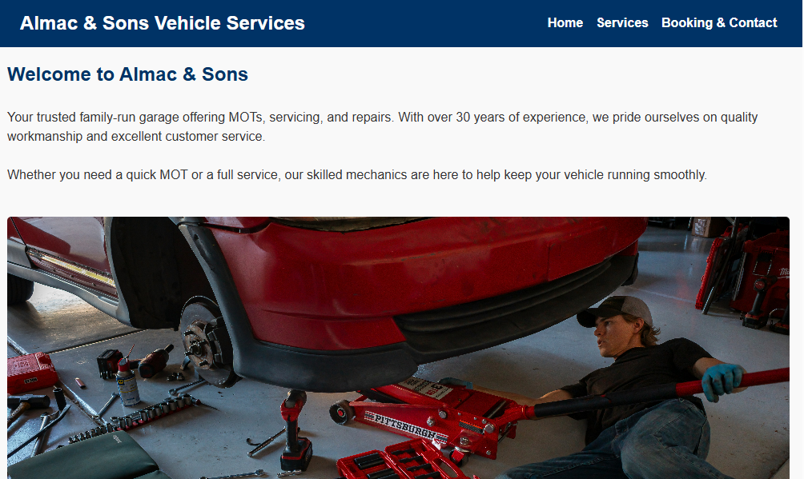
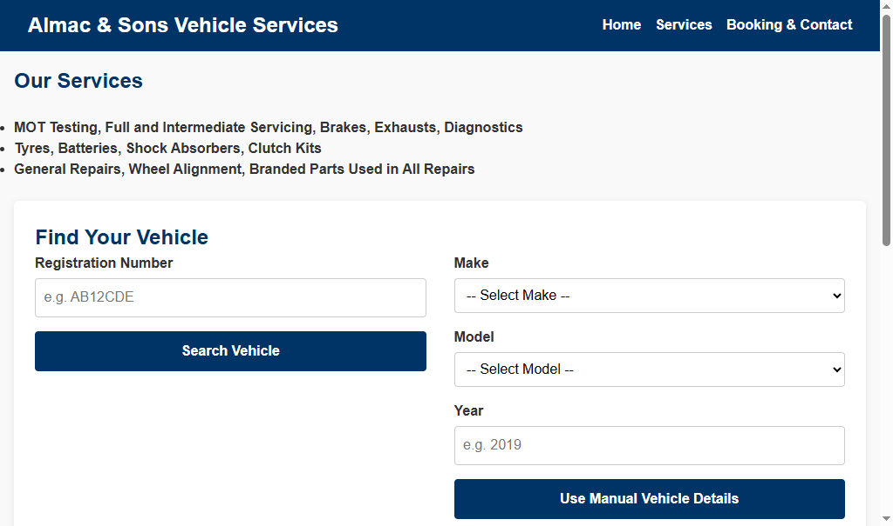
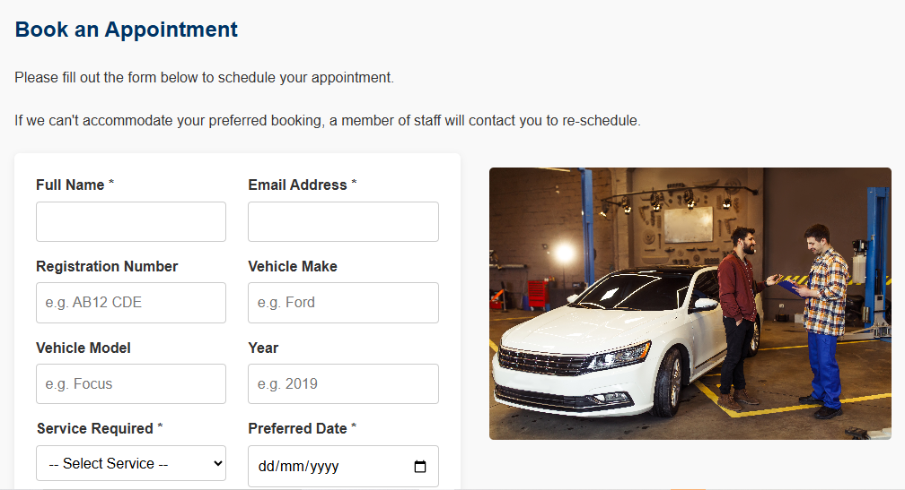
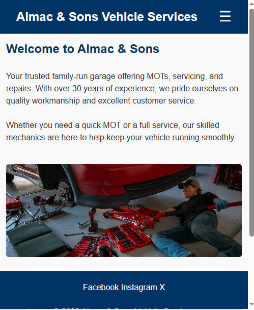
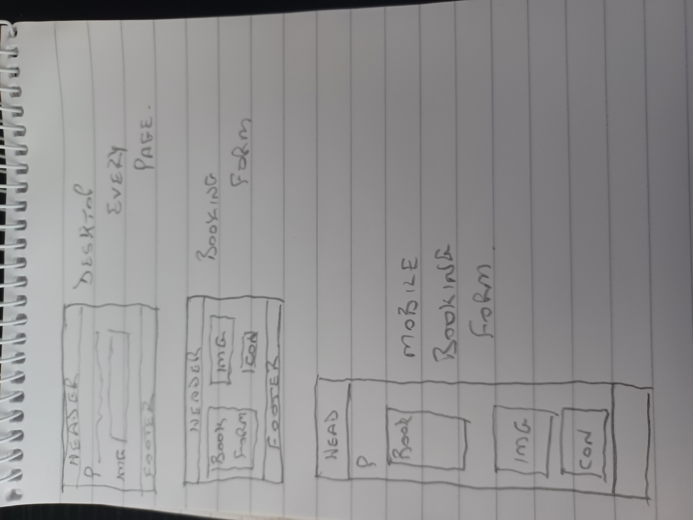
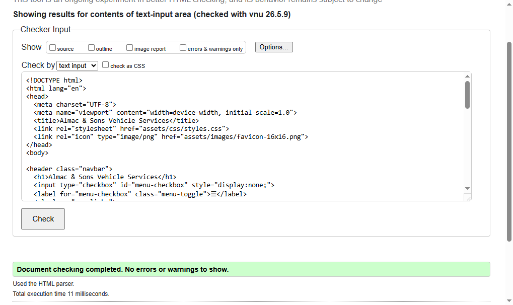
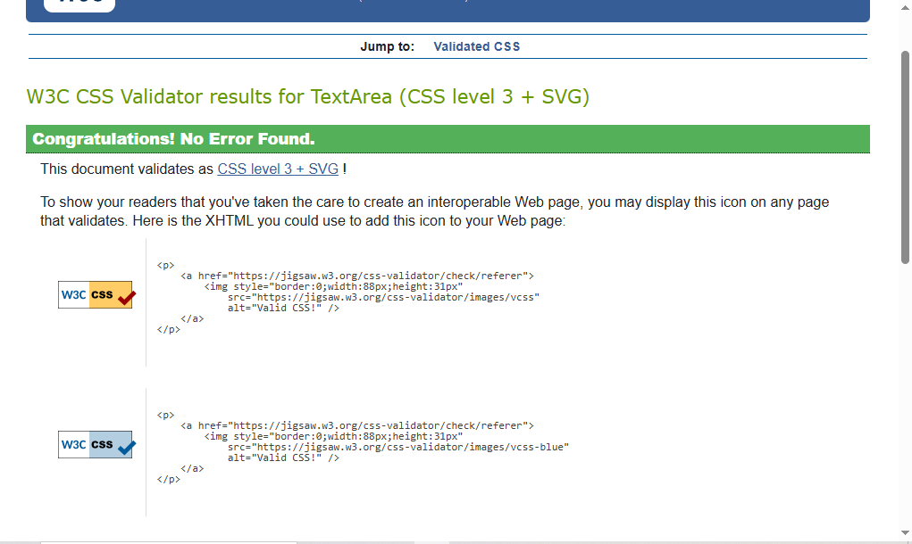
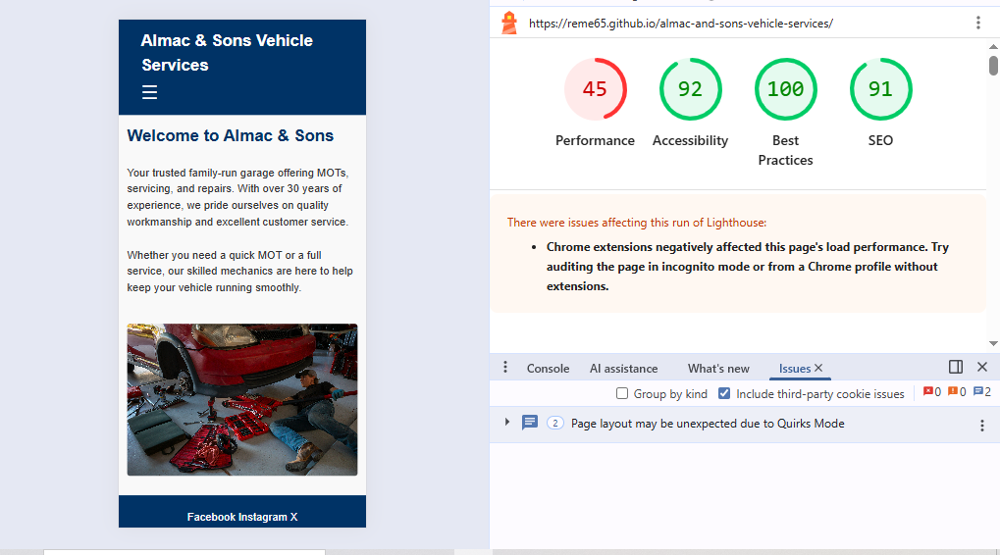

# Almac and Sons Vehicle Repairs Website

## Project Overview

This website was created as **Project 1** for the **Code Institute Diploma in Web Application Development**.

The aim of the project is to design and build a responsive static website using **HTML5** and **CSS3**, demonstrating fundamental front-end web development skills including responsive design, accessibility, testing, deployment and version control.

The website represents a family-run local garage offering:

- MOT testing
- Vehicle servicing
- General repairs

The site was designed to be professional, easy to navigate and accessible across desktop, tablet and mobile devices.

---

## Live Site

Live Site: [Almac and Sons Vehicle Repairs](https://reme65.github.io/almac-and-sons-vehicle-services)

GitHub Repository: [GitHub Repository](https://github.com/Reme65/almac-and-sons-vehicle-services)

---

## User Experience (UX)

### Target Audience

The website is aimed at:

- Local vehicle owners
- Families looking for a trustworthy garage
- Customers requiring MOT testing, servicing or repairs

### User Goals

Users visiting the website should be able to:

- Understand what services are available
- Learn about the garage and its values
- Find contact details quickly
- Make a booking enquiry easily
- Navigate clearly across all pages

### Business Goals

The business goals of the site are to:

- Present a professional and trustworthy image
- Clearly advertise available garage services
- Encourage customers to make contact or submit booking enquiries

---

## User Stories and Evidence

| User Story | Feature Implemented | Evidence |
|---|---|---|
| As a visitor, I want to understand what the garage offers so I can decide if it meets my needs. | Homepage with service overview and branding | 
| As a customer, I want to view available services so I can choose the correct option. | Dedicated services page ||
| As a customer, I want to contact the garage easily so I can arrange work on my vehicle. | Booking and contact form |  |
| As a mobile user, I want the website to display correctly on smaller screens. | Responsive CSS layout using media queries |  |

### Homepage - Desktop View

### Homepage - Mobile View

### Services Page

### Booking Page

---

## Design

### Colour Scheme

The website uses a blue, white and dark grey colour palette to create a professional appearance associated with reliability and automotive services.

- Dark navigation areas improve contrast
- White text improves readability
- Consistent colours create visual continuity across pages

### Typography

The website uses:

- Arial
- Sans-serif fallback fonts

These fonts were selected because they are:

- Widely supported across browsers
- Easy to read
- Accessible on smaller screens and mobile devices

### Layout

The layout was designed with usability and responsiveness in mind.

Features include:

- Consistent navigation across all pages
- Clear content separation using semantic HTML elements
- Responsive layout adjustments for smaller screens
- Mobile-friendly spacing and image scaling

### Wireframes and Planning

Initial planning focused on creating a simple multi-page structure with:

- Homepage
- Services page
- Booking & Contact page
- Thank-you confirmation page

The structure was designed to allow users to move easily between pages while keeping key information visible and accessible. Basic idea can be found at 

---

## Features

### Existing Features

- Responsive navigation bar across all pages
- Homepage introducing the business
- Services page listing available garage services
- Booking and contact form
- Thank-you confirmation page
- Footer with external social links
- Responsive CSS media queries
- Accessible alt text on images

### Future Features

Potential future improvements include:

- Online booking calendar
- Google Maps integration
- Customer testimonials
- Expanded image gallery
- Service pricing section

---

## Technologies Used

### Languages

- HTML5
- CSS3

### Tools and Platforms

- GitHub
- GitHub Pages
- Chrome DevTools
- W3C HTML Validator
- W3C CSS Validator

---

## Accessibility

Accessibility was considered throughout development.

Accessibility features include:

- Semantic HTML structure
- Alt text on images
- Labels connected to form inputs
- Responsive text and layout scaling
- High contrast colour choices
- Mobile-friendly navigation

### Accessibility Testing

| Test | Result |
|---|---|
| Semantic HTML used | Pass |
| Form labels associated correctly | Pass |
| Colour contrast checked | Pass |
| Mobile responsiveness tested | Pass |
| Keyboard navigation checked | Pass |
| Focus visibility checked | Pass |

---

## Testing

### Manual Testing

| Feature | Test Performed | Expected Result | Outcome |
|---|---|---|---|
| Navigation links | Click each navigation link | Correct page opens | Pass |
| Booking form | Submit empty form | Browser validation displayed | Pass |
| Responsive layout | Resize browser window | Layout adapts correctly | Pass |
| Images | Load all pages | Images display correctly | Pass |
| Footer links | Click external links | Opens in new tab | Pass |

### Browser Testing

The website was tested in:

- Google Chrome
- Mozilla Firefox
- Microsoft Edge

### Device Testing

The website was tested using Chrome DevTools responsive mode for:

- Mobile devices
- Tablets
- Desktop screens

---

## Validator Testing

### HTML Validation

All pages were tested using the W3C HTML Validator.

### CSS Validation

CSS was tested using the W3C CSS Validator.

---

## Lighthouse Testing

Lighthouse testing was completed using Chrome DevTools.

---

## Bugs and Fixes

| Bug | Fix Applied |
|---|---|
| Broken image link on thank-you page | Corrected image file path |
| Footer external links security warning | Added rel="noopener noreferrer" |
| Duplicate CSS code | Cleaned and reorganised styles.css |
| Desktop scrolling issue | Adjusted CSS overflow settings |

### Remaining Bugs

No known unresolved bugs at the time of submission.

---

## Development Life Cycle

The project followed a staged development process:

1. Initial planning and page structure
2. HTML page creation
3. CSS styling and responsive layout implementation
4. Accessibility improvements
5. Testing and debugging
6. Deployment using GitHub Pages
7. Final documentation and validation

GitHub commits were used throughout development to track changes and improvements.

---

## Deployment

The website was deployed using GitHub Pages.

### Deployment Steps

1. Create a GitHub repository
2. Upload project files
3. Open repository settings
4. Navigate to Pages
5. Select the main branch
6. Save deployment settings
7. Access the generated live link

---

## Credits

### Content

All written content was created for educational purposes as part of this project.

### Images

Some photographs were sourced from:

- Unsplash
- Freepik

### Favicon

Favicon generated using:

- favicon.io

### Code

All code was written by the developer.

---

## Acknowledgements

- Code Institute learning materials
- Mentor support and feedback
- Online HTML and CSS documentation resources

